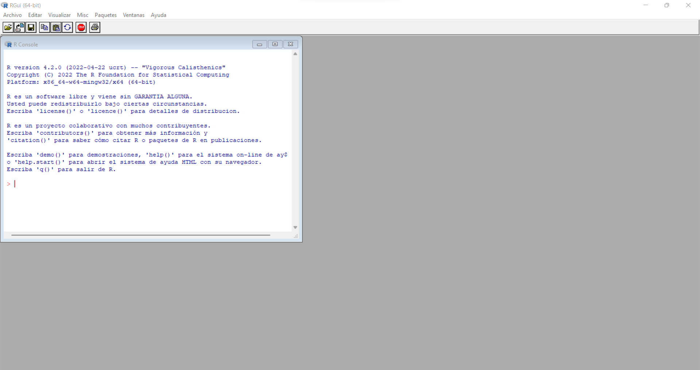
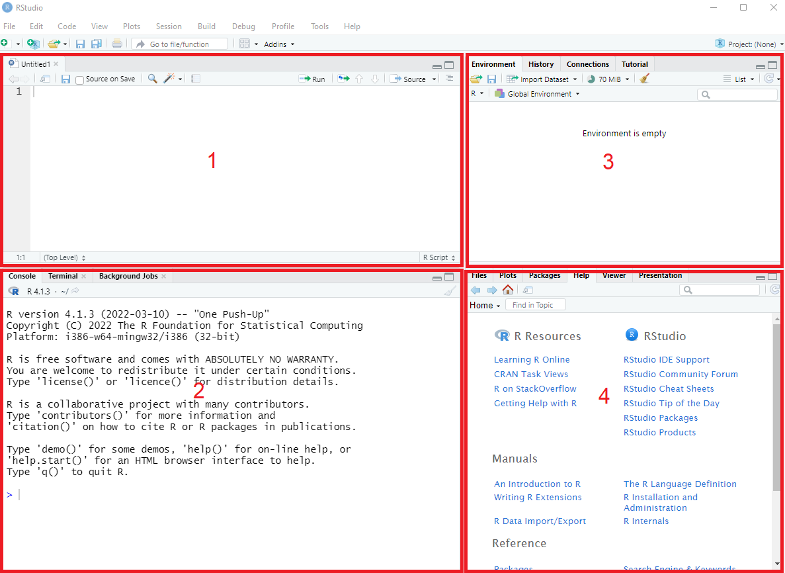

# Introducción

El término estadística hace referencia a la "Ciencia de las cosas que pertenecen al estado" ampliamente 
utilizado desde hace décadas,debido a que durante muchos años fue el estado el único que
podia realizar recolección de datos,estudios y análisis sociales,demográficos y económicos para el desarrollo
de políticas públicas.Sin embargo desde los años 80 y de ahi en adelante la computación
e informática han permitido que no solo el estado sea quien pueda desarrollar estos estudios,
permitiendo además minimizar los tiempos de recolección de información,gastos y costos de almacenamiento
así como de procesamiento.

De esta forma es que el término estadística a evolucionado hacia un concepto más amplio
acerca de las técnicas,métodos y herramientas que puede utilizar,incluso habilitando el 
considerar como objeto de estudio áreas que por su heterogeneidad, décadas atrás habria sido imposible contemplar para su estudio.Es por eso que hoy en dia la estadística se vuelto uno de los pilares fundamentales de lo que hoy se conoce como Ciencia de Datos junto a otras áreas como las matematicas,informática,entre otras.

En este contexto,este libro introduce al uso de aplicaciones estadísticas mediante la integración
del software R y R Studio,ya que es uno de los con mayor demanda en el mundo asi como Python,Julia,SPSS,entre otros pero que no se consideran en este libro.

## Como esta organizado este libro

Cada de una de las secciones de este libro estan desarrolladas de forma que el lector vaya
conociendo desde las técnicas fundamentales hasta aquellas que son mas avanzadas y que en algunos casos
es necesario ir integrando lo leido para comprender aquellas que puedan tener una mayor complejidad,
sin embargo es posible que si deseas volver a revisar alguna técnica en particular no sea estrictamente
necesario que tengas que revisar cada una de las secciones.

* __Cuerpo Teórico__: En el libro se abordan cada una de las técnicas estadisticas inicialmente desde un punto de vista teorico 
pero pragmatico,en este sentido no se desarrollan todas las demostraciones necesarias para concluir algunas de las formulas
que se expresan.En algunas secciones solo cuando se hace necesario se integran tanto formulas como el tratamiento de datos por software.

* __Visualización__: Si bien, la visualización de datos y/o estructuras de información es un campo bastante amplio para cubrir en este
libro, se hace uso algunas librerias de visualización para la representación de diagramas de dispersión,de cajas, entre otros
cuando sea necesario representar graficamente aspectos o patrones que no son reconocibles al inspeccionar un set de datos. 

* __Software__:A pesar de que este documento,no es un libro acerca de programación y/o estructura de datos.Se hace fundamental
el uso de un software que permita resolver numericamente los problemas que se exponen en el libro,ya que este nos permite aplicar
los conceptos y técnicas estadisticas en un entorno real,pudiendo incluso dentro de el realizar visualizaciones.Cabe destacar que el software R y R Studio incluso nos permite desarrollar informes,sin embargo es un topico que no trataremos en este libro debido a la extensión del mismo.

## Un breve recorrido por R y R Studio

Tal vez es necesario una clara distinción entre los software R y R Studio,sobre todo porque en estos días la compañia R Studio
a pasado a llamarse Posit,lo cual es mas que un simple cambio de nombre,mas adelante explicaremos brevemente el porque de la distinción.

R es un lenguaje de cómputo estadístico y visualización desarrollado en la Universidad de Auckland en 1993, sin embargo hasta el día de hoy se sigue utilizando y sobretodo en los ultimos años a tenido una mayor demanda tanto en la industria como en la academia debido a su carácter de Open Soruce,además de poseer una gran cantidad de librerías que permiten extender las capacidades básicas del mismo sin ningún costo.Es asi que con R es posible realizar desde operaciones aritméticas sencillas,implementar técnicas estadísticas como modelos de regresión,análisis de series temporales, desarrollo de gráficos interactivos e incluso algoritmos de machine learning.

En cambio R Studio es un Entorno de Desarrollo Integrado(IDE),que brinda al software R de una interfaz visual en donde es
posible gestionar en una única ventana los distintos documentos,scripts,set de datos y/o visualizaciones,esto debido a que la interfaz se compone de varios paneles que organizan cada uno de estos de forma óptima.Junto a lo anterior,R Studio tambien permite
el uso de software de terceros como Github,Spark,conexiones a bases de datos,entre otros.Estos últimos aspectos no se tratarán en este libro,sin embargo son utilizados de forma intensiva en conjunto.Para la instalación del software R,pueden acceder directamente a su web [R](https://www.r-project.org/) 

A continuación se muestra la ventana principal de R.

Este es la interfaz grafica de usuario de R (GUI), que podemos utilizar una vez que se haya instalado correctamente el software.Como se ve en la imagen solo es posible acceder a la consola asi como a algunas opciones en la barra de herramientas superior.Si bien es posible desarrollar cualquier instrucción tipica de R,tal vez en algunos casos cuando requerimos de una distribución mas clara de cada uno de los objetos,variables,gráficos u otros elementos,será mucho mas útil utilizar el entorno de desarrollo R Studio.Sin embargo,para instalar R Studio deben haber instalado primero R desde la web anterior y para instalar el IDE R Studio,deben ingresar a la siguiente web [R Studio](https://www.rstudio.com/) ...la cual próximamente cambiara a Posit.

A continuación se muestra una imagen de la ventana principal de R Studio.

En el primer panel se ubica la ventana de script,en donde es posible escribir aquellas instrucciones secuenciales que queremos que se ejecuten, sean operaciones aritmeticas,definición de variables, gráficos,entre otras.Luego el segundo panel se ubica la consola junto a otros sub-paneles en donde es posible ejecutar instrucciones una a una dentro de otras fuera del entorno de R,además es la ventana original que brinda el software R sin el uso del IDE de R Studio.En el tercer panel se ubica la ventana en donde se almacenan variables como vectores,matrices,listas entre otras estructuras de datos,a las cuales se puede acceder directamente desde este panel o desde un script o la consola.Finalmente en la cuarta ventana se ubica el directorio de trabajo asi como otros sub-paneles en donde se puede acceder a la ayuda de R,gráficos desarrollados,entre otros.
