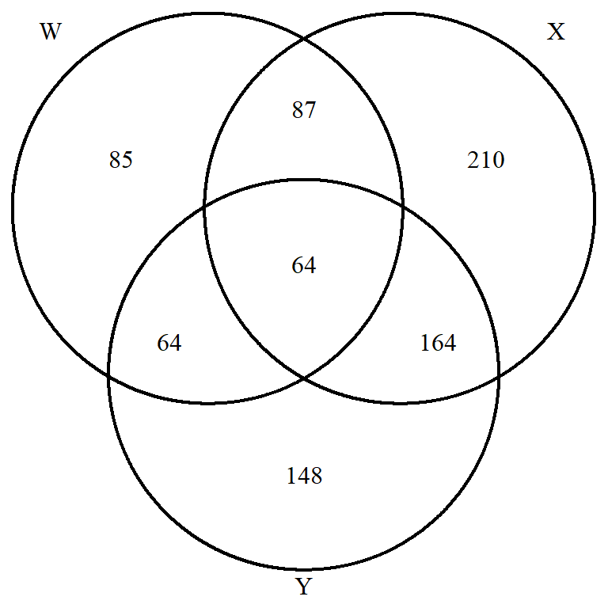

# Probabilidades

Asi como se mencionó en el capítulo anterior,la estadística a cobrado un papel mas relevante en el siglo XXI,sobretodo porque nos a permitido generar mayores eficiencia en las industrias debido al uso de métodos estadísticos que han permitido desarrollar mejores hipótesis de trabajo,pronósticos y proyecciones en el corto y largo plazo.Esto sin duda permite que las fabricas se pueden anticipar a las demandas del mercado,pudiendo asi manufacturar productos estandarizados para toda la población,pudiendo asi incluso minimizar el costo de estos.

En este contexto hemos podido gestionar de mejor forma la incertidumbre y el riesgo asociados a la producción de materias primas,producción en masa y demandas de la población.Tal vez uno de los logros mas importantes de la humanidad,es haber cambiado de una mentalidad deterministica acerca del mundo hacia una probabilistica, lo cual implica cambios profundos en todos los quehaceres de la población,en algunos textos incluso se habla acerca del _Statistical Thinking_, lo cual es una forma probabilística de ver el mundo,lo cual impacta directamente en como nos relacionamos frente a la incertidumbre y la respuesta que tenemos desde todos los sistemas con los que nos relacionamos.

## Variabilidad en el mundo real

Cada dia cuando nos levantamos de la cama a pesar de poner la alarma a la misma hora,nunca nos levantamos exactamente a la misma hora y esto no se debe a que la alarma del reloj se encuentre defectuosa,sino que estamos ante la variabilidad desde que nos levantamos e incluso durante todo el dia hasta que nos volvemos a acostar por la noche.Asi mismo cuando en un estudio clinico se desea estudiar la concentración de glucosa en sangre, nunca obtendremos exactamente la misma cantidad en cada una de las personas que se toman este examén,sin embargo si deseamos que estas concentraciones se acerquen o convergan a un cierto valor,lo mismo aplica para la hora que nos levantamos.

Debido a la existencia de un mundo probabilistico y no deterministico,es que los métodos y técnicas estadisticas se vuelven fundamentales,en caso contrario si el mundo fuera deterministico seria bastante fácil la vida en si misma.

Sin embargo para hacer frente a la variabilidad es fundamental comprender algunos conceptos que permiten el desarrollo de métodos posteriores,que nos permitiran avanzar en las direcciones principales de este libro: Probabilidades y Estadística.Cabe destacar que la estadística se compone de 2 grandes áreas que tambien se consideran en este libro correspondientes a la Estadística Descriptiva e Inferencial.

## Variabilidad e incertidumbre

En algunas ocasiones tendemos a intercambiar los conceptos de variabilidad,incertidumbre y riesgo,sin embargo es fundamental hacer la aclaración,ya que son fundamentalmente distintos.

Si consideramos el peso corporal como una variable de estudio entre los miembros de una población,podriamos considerar el peso promedio de la población mediante la recolección de estos datos,sin embargo no todos los individuos tendran el mismo peso algunos estaran por debajo del peso promedio y otros por encima,tal vez algunos pocos tendran exactamente el peso promedio,a esto le llamamos variabilidad.

Sin embargo,sino consideramos en nuestro estudio,hipótesis o teoria algunos aspectos como el lugar de residencia de estas personas asi como de sus hábitos de consumo,sexo,entre otros factores,estaremos introduciendo incertidumbre al estudio.

De otra forma podemos decir que la variabilidad no puede ser reducida en una población o muestras extraidas,sin embargo la incertidumbre si puede ser reducida e incluso eliminada con mayor información o datos

## Probabilidad

Para la estadistica es fundamental poder tener información o un conjunto de datos de la población que queremos estudiar,sin embargo no siempre sera posible estudiar directamente la población ante lo cual utilizaremos una muestra para el analísis de las variables o factores de interes.A pesar de esto, en muchas situaciones no siempre contaremos o existira la información que deseamos analizar,ante lo cual deberemos indagar en la naturaleza de los resultados de un experimento.

### Espacio Muestral

Al conjunto de todos los posibles elementos,resultados o puntos de un experimento le llamamos **espacio muestral** y lo podemos representar con el simbolo *S* u $\Omega$. 
Si consideramos el espacio muestral $\Omega$ de todos los elementos que obtenemos al lanzar una moneda al aire,se tiene lo siguiente:


\begin{align*}
\Omega=[ \ C,\ S \ ]
\end{align*}

### Eventos

Un **evento** es un subconjunto de elementos presentes en un espacio muestral. 

En este contexto si definimos el espacio muestral del lanzamiento de un dado de 6 caras que no se encuentra cargado

\begin{align*}
\Omega=[uno,dos,tres,cuatro,cinco,seis]
\end{align*}

En R podemos definir el vector omega que contenga a todos los elementos del espacio muestral \Omega.


```r
omega=c("uno","dos","tres","cuatro","cinco","seis")
```


El evento $A$ de obtener un numero menor que **cuatro** seria

\begin{align*}
A=[uno,dos,tres]
\end{align*}

Al igual que en el caso anterior podemos definir el vector A,pero en este caso solo contendra a los elementos menores que 4


```r
A=c("uno","dos","tres")
```


#### Complementos

El **complemento** de un evento respecto de \Omega,corresponde al subconjunto de todos aquellos elementos de $A$ que no estan en \Omega,asi podemos denotar al complemento como $A'$

De acuerdo al ejemplo anterior,el complemento de $A$

\begin{align*}
A'=[cuatro,cinco,seis]
\end{align*}

En R podemos definir nuevamente el complemento del evento $A$ ya definido como


```r
A_comp=c("cuatro","cinco","seis")
```


#### Intersección

La intersección entre dos eventos $A$ y $B$, se denota como $A$ $\cap$ $B$ y corresponde al evento que contiene a todos los elementos comunes entre $A$ y $B$.

Siguiendo con el espacio muestral \Omega ya definido,podemos establecer que la interseccion

\begin{align*}
\Omega \cap A=[uno,dos,tres]
\end{align*}

#### Eventos mutuamente excluyentes

Si dos eventos $A$ y $B$ no tienen elementos en común,decimos que los eventos son **mutuamente excluyentes**,es decir $A$ $\cap$ $B=\phi $

Si consideramos la intersección los eventos $A$ y $A'$ determinados en la sección anterior,tenemos que

\begin{align*}
A \cap \ A'=\phi
\end{align*}

#### Union

La union entre 2 eventos $A$ y $B$ se denota como $A$ $\cup$ $B$,en donde la unión contiene a todos los elementos presentes tanto en $A$ como en $B$.

Usando los eventos $A$ y $A'$ ya definidos anteriormente,podemos establecer la union


\begin{align*}
A \cup \ A'=[uno,dos,tres,cuatro,cinco,seis]
\end{align*}

Asi como hemos visto la relación entre eventos y el espacio muestral \Omega, tambien podemos representar de forma grafica estas relaciones con un diagrama de Venn, 

En R podemos realizar esta representacion grafica mediante la libreria *VennDiagram*.Si definimos un set de datos luego lo podemos representar mediante la funcion *display_venn()* como se muestra a continuación


```r
# Diagrama de Venn para las relaciones entre los eventos W,X e Y
display_venn(x[1:3])
```




### Probabilidades de un evento

Si consideramos un evento $A$,la probabilidad de este evento corresponde a la suma de todos los elementos muestrales en A,asi tenemos lo siguiente:

\begin{align*}
0 \le P(A) \le  1 \\ \\
P(\theta)=0 \\ \\
P(S)=1 
\end{align*}


```python
x=[1,2,3]
```


```r
x=c(1,2,3)
```

